# DSMS Architecture - UML Class Diagram

```mermaid
classDiagram
    %% ============================================
    %% MODELS PACKAGE
    %% ============================================
    
    namespace Models {
        class User {
            +ObjectId _id
            +String email
            +String password
            +String firstName
            +String lastName
            +String role
            +String phoneNumber
            +Array enrolledCourses
            +Array completedCourses
            +create()
            +findById()
            +findByEmail()
            +update()
            +delete()
        }

        class Booking {
            +ObjectId _id
            +ObjectId instructorId
            +ObjectId studentId
            +ObjectId courseId
            +Date date
            +String time
            +Number duration
            +String status
            +String attendance
            +create()
            +findById()
            +findAll()
            +update()
            +delete()
        }

        class Schedule {
            +ObjectId _id
            +ObjectId instructorId
            +String dayOfWeek
            +Array timeSlots
            +Boolean isActive
            +create()
            +findById()
            +update()
            +delete()
        }

        class Progress {
            +ObjectId _id
            +ObjectId studentId
            +ObjectId courseId
            +Number hoursCompleted
            +Number progressPercentage
            +String status
            +create()
            +findById()
            +update()
            +delete()
        }

        class Payment {
            +ObjectId _id
            +ObjectId studentId
            +Number amount
            +String type
            +String paymentMethod
            +String status
            +create()
            +findById()
            +update()
            +delete()
        }

        class Feedback {
            +ObjectId _id
            +ObjectId studentId
            +ObjectId instructorId
            +ObjectId courseId
            +Number rating
            +String category
            +String comment
            +create()
            +findById()
            +update()
            +delete()
        }

        class Notification {
            +ObjectId _id
            +ObjectId userId
            +String title
            +String message
            +String type
            +Boolean read
            +create()
            +findById()
            +update()
            +delete()
        }

        class Course {
            +ObjectId _id
            +String name
            +String description
            +Number duration
            +Number price
            +String category
            +Boolean isActive
            +create()
            +findById()
            +findAll()
            +update()
            +delete()
        }

        class Assessment {
            +ObjectId _id
            +ObjectId studentId
            +ObjectId instructorId
            +ObjectId courseId
            +String type
            +Number score
            +String status
            +Date dueDate
            +create()
            +findById()
            +update()
            +delete()
        }
    }

    %% ============================================
    %% CONTROLLERS PACKAGE
    %% ============================================

    namespace Controllers {
        class UserController {
            +create()
            +getAll()
            +getById()
            +update()
            +delete()
            +login()
            +register()
            +enrollCourse()
            +markCourseComplete()
        }

        class BookingController {
            +create()
            +getAll()
            +getById()
            +update()
            +delete()
            +getUpcoming()
            +checkAvailability()
            +complete()
        }

        class ScheduleController {
            +create()
            +getAll()
            +getById()
            +update()
            +delete()
            +getInstructorSchedule()
            +copyWeek()
        }

        class ProgressController {
            +create()
            +getAll()
            +getById()
            +update()
            +delete()
            +getStudentProgress()
            +getSummary()
        }

        class PaymentController {
            +create()
            +getAll()
            +getById()
            +update()
            +delete()
            +processPayment()
            +getStudentPayments()
        }

        class FeedbackController {
            +create()
            +getAll()
            +getById()
            +update()
            +delete()
            +getInstructorFeedback()
            +getInstructorRating()
        }

        class NotificationController {
            +create()
            +getAll()
            +getById()
            +update()
            +delete()
            +getUserNotifications()
            +markAsRead()
            +markAllAsRead()
        }

        class CourseController {
            +create()
            +getAll()
            +getById()
            +update()
            +delete()
        }

        class AssessmentController {
            +create()
            +getAll()
            +getById()
            +update()
            +delete()
            +grade()
            +getStudentAssessments()
        }
    }

    %% ============================================
    %% VIEWS PACKAGE
    %% ============================================

    namespace Views {
        class AdminDashboard {
            +ManageUsers()
            +ManagePayments()
            +ManageCourses()
            +GenerateCertificate()
        }

        class InstructorDashboard {
            +ManageSchedule()
            +ManageBookings()
            +ManageAssessments()
            +ViewFeedback()
        }

        class StudentDashboard {
            +ViewCourses()
            +BookLesson()
            +PaymentHistory()
            +ViewProgress()
        }
    }

    %% ============================================
    %% RELATIONSHIPS
    %% ============================================

    %% Controllers to Models
    UserController --> User
    BookingController --> Booking
    ScheduleController --> Schedule
    ProgressController --> Progress
    PaymentController --> Payment
    FeedbackController --> Feedback
    NotificationController --> Notification
    CourseController --> Course
    AssessmentController --> Assessment

    %% Views to Controllers
    AdminDashboard --> UserController
    AdminDashboard --> PaymentController
    AdminDashboard --> CourseController

    InstructorDashboard --> BookingController
    InstructorDashboard --> ScheduleController
    InstructorDashboard --> AssessmentController

    StudentDashboard --> BookingController
    StudentDashboard --> CourseController
    StudentDashboard --> PaymentController

    %% Model Associations
    Booking --> User
    Booking --> Course
    Schedule --> User
    Progress --> User
    Progress --> Course
    Payment --> User
    Feedback --> User
    Feedback --> Course
    Assessment --> User
    Assessment --> Course
```



## Architecture Overview

**3-Tier MVC Architecture** for Driving School Management System

### Packages:

**1. Models Package** - Data entities (9 classes)
- User, Booking, Schedule, Progress, Payment, Feedback, Notification, Course, Assessment

**2. Controllers Package** - Business logic & API handlers (9 classes)
- Handle HTTP requests, process business logic, manage data flow

**3. Views Package** - User interfaces (3 dashboards)
- AdminDashboard, InstructorDashboard, StudentDashboard

### Data Flow:
```
View → Controller → Model → Database
```
